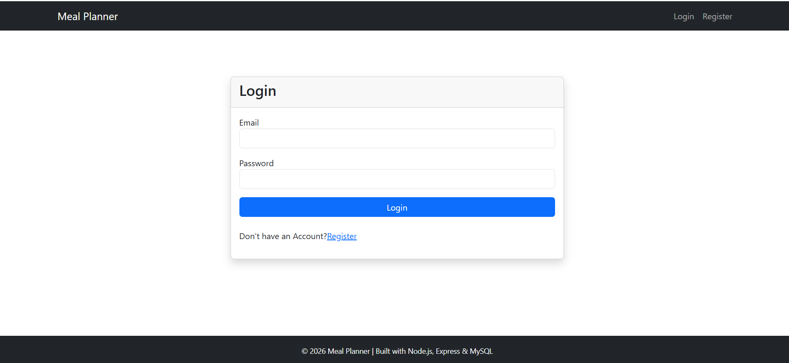
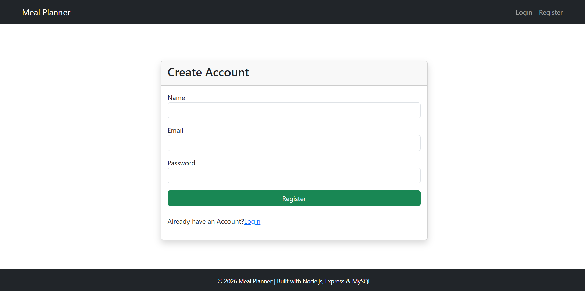
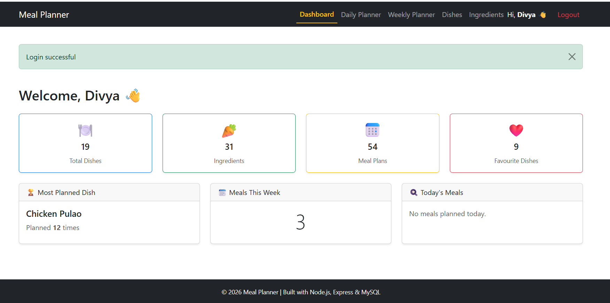
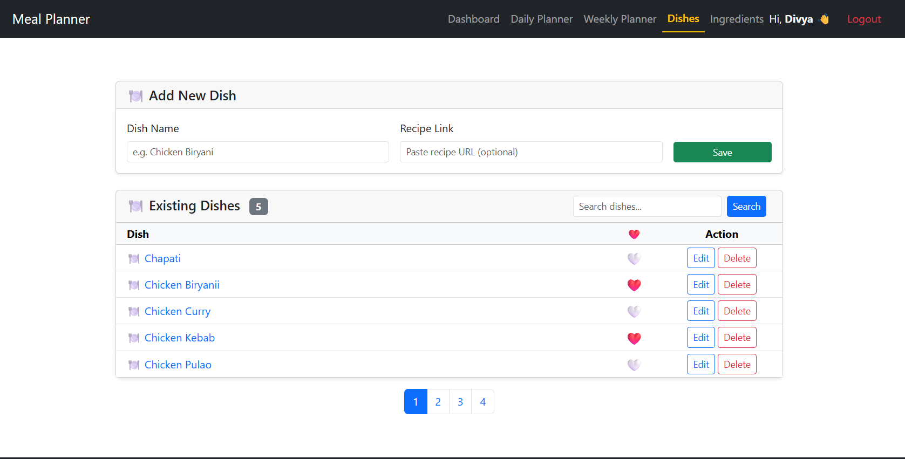
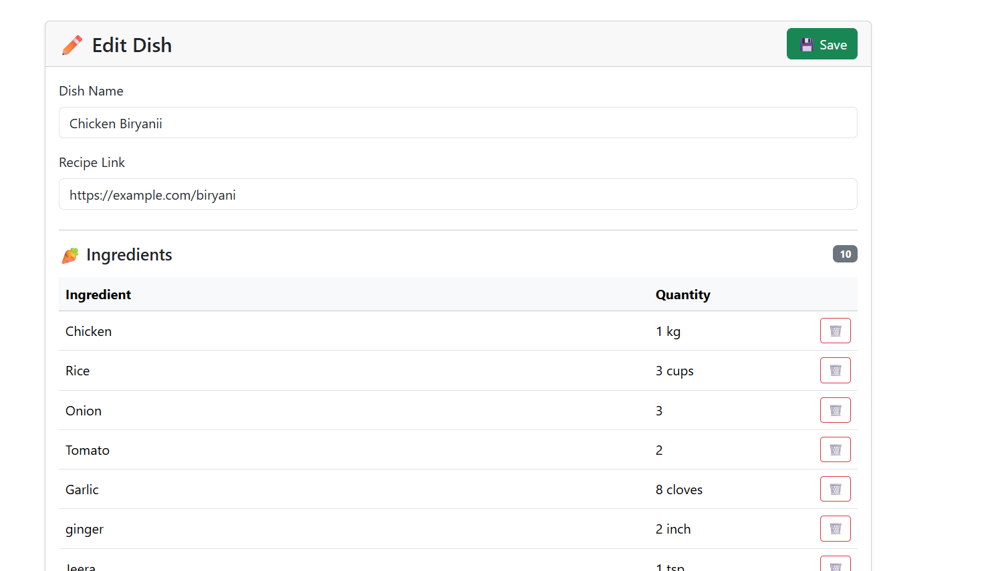
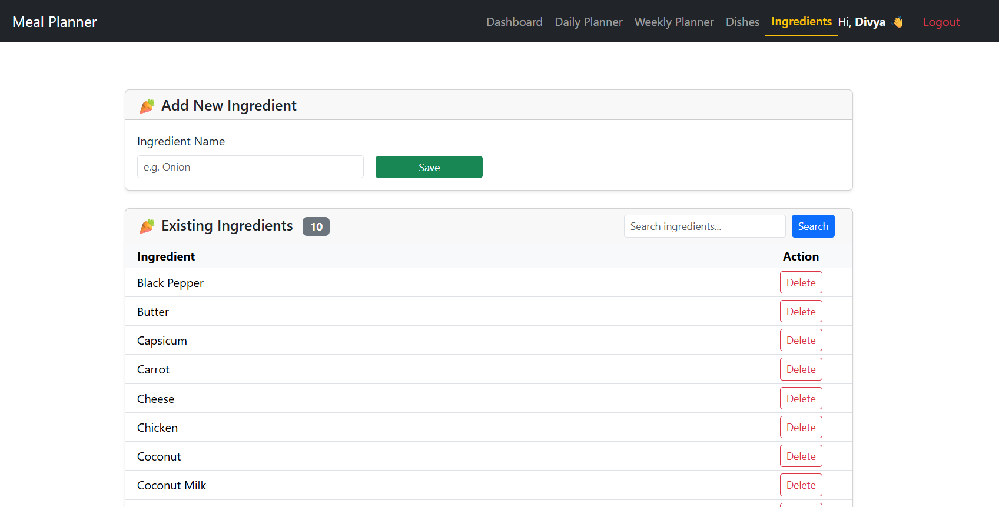
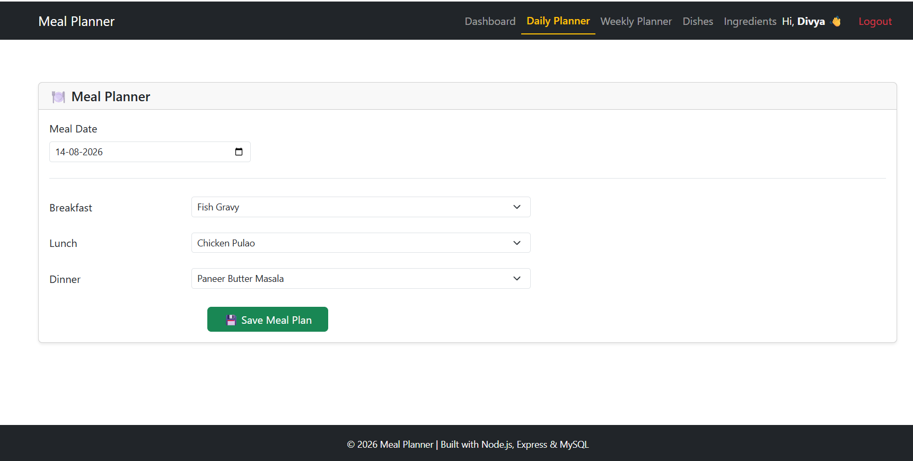
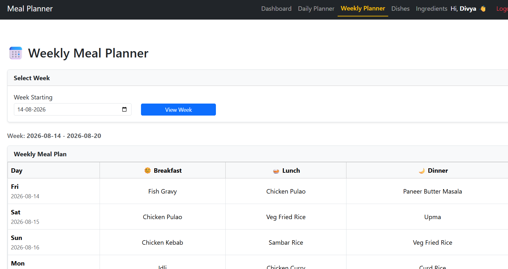

# 🍽️ Meal Planner

A full-stack web application built using **Node.js, Express.js, MySQL, EJS, and Bootstrap** to help users organize meals, manage dishes and ingredients, plan daily and weekly meals, and generate shopping lists.

---

## ✨ Features

### 📊 Dashboard

* View total dishes
* View total ingredients
* View total meal plans
* View favourite dishes
* View the most planned dish
* View today's meals

### 🍲 Dish Management

* Add, edit, and delete dishes
* Save recipe links
* Search dishes
* Mark dishes as favourites
* Manage ingredients for each dish

### 🥕 Ingredient Management

* Add and delete ingredients
* Prevent deletion of ingredients currently used in dishes
* Search ingredients

### 🍽️ Daily Meal Planner

* Plan breakfast, lunch, and dinner
* Automatically load saved meals for a selected date
* Update existing meal plans

### 📅 Weekly Planner

* View meals for an entire week
* Organised day-wise display
* View breakfast, lunch, and dinner for each day

### 🛒 Shopping List

* Generate ingredients required for the selected day's meals

### 🔐 Authentication

* User registration
* User login
* Session-based authentication
* Protected application routes

---

## 🛠️ Technologies Used

* Node.js
* Express.js
* MySQL
* EJS
* Bootstrap 5
* Express Session
* Connect Flash

---

## 🗄️ Database Tables

The application uses the following tables:

* `Users`
* `Dishes`
* `Ingredients`
* `DishIngredients`
* `MealPlans`

---

# 📸 Screenshots

## 🔐 Login

**File:** `screenshots/login.png`

---

## 📝 Registration

**File:** `screenshots/register.png`

---

## 📊 Dashboard

**File:** `screenshots/dashboard.png`

---

## 🍲 Dishes

**File:** `screenshots/Dishes.png`

---

## ✏️ Edit Dish

**File:** `screenshots/EditDish.png`

---

## 🥕 Ingredients

**File:** `screenshots/Ingredients.png`

---

## 🍽️ Daily Meal Planner

**File:** `screenshots/daily_planner.png`

---

## 📅 Weekly Meal Planner

**File:** `screenshots/weekly.png`

---

## 🚀 Future Enhancements

* Export shopping list as PDF
* Nutrition tracking
* Mobile application
* AI-powered meal recommendations
* Grocery price comparison

---

## 👩‍💻 Author

**Divya Menezes**

Built as a full-stack portfolio project using Node.js, Express.js, MySQL, EJS, and Bootstrap.
